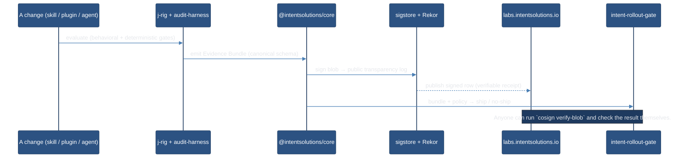

# Intent Eval Platform

> **Audit-first AI evaluation.** Six composable, agent-native, Apache-2.0 repos that let any engineering org *prove* — not just claim — that an AI change works, with a cryptographically signed receipt anyone can verify.
>
> *Measure the behavior. Sign the result. Gate the ship.*

<p>
  <a href="https://labs.intentsolutions.io/"></a>
  <a href="https://www.npmjs.com/package/@intentsolutions/core"></a>
  <a href="https://www.npmjs.com/package/@intentsolutions/audit-harness"></a>
  
</p>

This repo is the **umbrella** for the Intent Eval Platform. Each component is its own
independently developed and released repository; this repo is the map — **what they
are, what they do, how they converge, and why it matters.** No application code lives
here.

---

## The problem

AI evaluation has a trust gap. Anyone can publish a benchmark number. The question that
matters when something ships — to a compliance officer, an on-call engineer, a customer's
security team — isn't *"what's the score?"* It's *"how do I know that score is real, that
it wasn't quietly edited after the run, and that it came from the code you actually
shipped?"*

Most eval tooling answers the first question and skips the second. **A number is not
evidence.** Evidence is a number you can independently verify.

## How we're different

The category optimizes one axis: produce a score. We compete on a different one:
**produce signed, reproducible evidence — and gate the ship on it.**

| Capability | Eval frameworks<br><sub>OpenAI evals · Braintrust · Langfuse</sub> | Memory-eval boards<br><sub>gbrain-evals · LongMemEval</sub> | **Intent Eval Platform** |
|---|:---:|:---:|:---:|
| Behavioral scoring | ✅ | ✅ | ✅ |
| Binary, non-laundered verdicts (no aggregate PASS%) | ◑ | ◑ | ✅ |
| Canonical cross-tool contract (one schema, many emitters) | ❌ | ❌ | ✅ Evidence Bundle |
| **Cryptographic receipt** — sigstore-signed, Rekor-anchored | ❌ | ❌ | ✅ public transparency log |
| Reproducible-by-signature (not just by transparency) | ◑ | ✅ transparency | ✅ **+ signature** |
| Ship/no-ship gate consuming the evidence | ◑ | ❌ | ✅ rollout gate |
| Deterministic test-policy enforcement (AI-proof) | ❌ | ❌ | ✅ audit-harness |

<sub>✅ first-class · ◑ partial / varies · ❌ not in the architecture. An architectural
contrast, not a feature-by-feature audit.</sub>

**The differentiator in one line:** every validator in this platform emits the same
**Evidence Bundle**, and an Evidence Bundle can be signed into the public sigstore
transparency log — so a third party verifies the result *without trusting us*. That's a
layer a scoreboard of unsigned numbers structurally cannot offer.

## What's in the stack

| Repo | Role | What it does |
|------|------|--------------|
| **[intent-eval-core](https://github.com/jeremylongshore/intent-eval-core)** (`@intentsolutions/core`) | **Contracts kernel** | The canonical schema everything converges on — TypeScript types, JSON Schemas, Zod validators, and state machines for the platform's canonical entities (incl. the Evidence Bundle + `gate-result/v1` predicate). No runtime, no judges — just the contract. Published to npm with sigstore provenance. |
| **[intent-eval-lab](https://github.com/jeremylongshore/intent-eval-lab)** | **Methodology + specs** | The constitution: vendor-neutral evaluation methodology, normative spec modules, Decision Records, the canonical glossary. Where the *why* and the *rules* live. |
| **[intent-audit-harness](https://github.com/jeremylongshore/intent-audit-harness)** | **Deterministic gates** | AI-proof test-policy enforcement. Hash-pins engineer-owned testing config so AI-proposed threshold-weakening is blocked at pre-commit. Ships escape-scan, CRAP, architecture, bias, and Gherkin-lint gates — each emits Evidence Bundle rows. |
| **[j-rig-skill-binary-eval](https://github.com/jeremylongshore/j-rig-skill-binary-eval)** | **Behavioral eval** | Binary-criteria evaluation for Claude skills (extending to plugins, agents, MCP servers). Scores every change yes/no across 7 layers — package integrity, trigger quality, functional quality, regression, baseline value, model variance, rollout safety. Never gradients. |
| **[intent-rollout-gate](https://github.com/jeremylongshore/intent-rollout-gate)** | **Ship decision** | A GitHub Action that consumes an Evidence Bundle + a repo policy and decides ship / no-ship / advisory. The platform's user-facing CI gate. |
| **[intent-eval-dashboard](https://github.com/jeremylongshore/intent-eval-dashboard)** | **Public surface** | The reports dashboard at **[labs.intentsolutions.io](https://labs.intentsolutions.io/)** — eval-set browser + the Evidence Bench scorecard where signed results are published and independently verifiable. |

All six are **Apache-2.0**.

## How it converges

The repos don't merge into a monolith — they compose at the **schema layer**. One fact's
journey from a code change to a signed, ship-gating verdict:



The shared **Evidence Bundle** (defined in `intent-eval-core`) is the convergence point.
Every validator emits one; the dashboard renders them; the rollout gate decides on them;
sigstore signs them. Add a new emitter and it plugs into the whole platform for free.

## See it live

A real signed result is published right now:

- **Scorecard:** [labs.intentsolutions.io/eval-sets/j-rig-bench/](https://labs.intentsolutions.io/eval-sets/j-rig-bench/)
- **Plain-English walkthrough** (what we did, how, and the proof): [/eval-sets/j-rig-bench/phase-a0/](https://labs.intentsolutions.io/eval-sets/j-rig-bench/phase-a0/)
- **The public receipt** (raw Rekor transparency-log entry): [rekor.sigstore.dev · logIndex 1689291334](https://rekor.sigstore.dev/api/v1/log/entries?logIndex=1689291334)

You don't have to trust any of it — that's the point. Verify it yourself.

---

## Ecosystem manifest + drift report (report-only)

[`ecosystem.json`](./ecosystem.json) is the machine-readable map of the six platform
repos — each repo's kind, its release channel (npm or git tag), and the **pinned
version** the platform considers current. [`scripts/ecosystem-drift.py`](./scripts/ecosystem-drift.py)
reads the manifest and reports which repos have drifted behind their live upstream. The
[`ecosystem-drift`](./.github/workflows/ecosystem-drift.yml) workflow runs it weekly and
on manifest changes, writing the report to the run summary.

**This is a report-only safe slice.** The checker has read-only permissions, opens no
PRs, and mutates nothing — it always exits 0 (drift is advisory). Acting on drift means
re-verifying upstream and bumping `pinned_version` in `ecosystem.json` via a reviewed PR.

`claude-code-plugins` is deliberately listed under `excluded`, not automated: it has
bespoke in-flight CI/CD, so any future sync automation must be coordinated with that
pipeline first and sequenced last. Turning on auto-PR (and folding in the excluded repo)
is a separate, explicitly-reviewed change — not a config flip.

```bash
python3 scripts/ecosystem-drift.py   # prints the drift table; opens nothing
```

---

<sub>Intent Solutions · [intentsolutions.io](https://intentsolutions.io) · Apache-2.0</sub>
